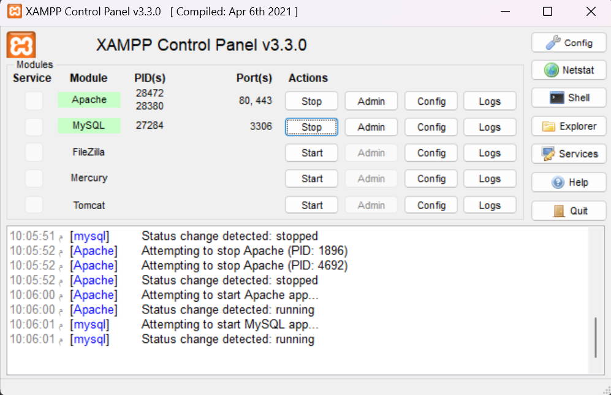
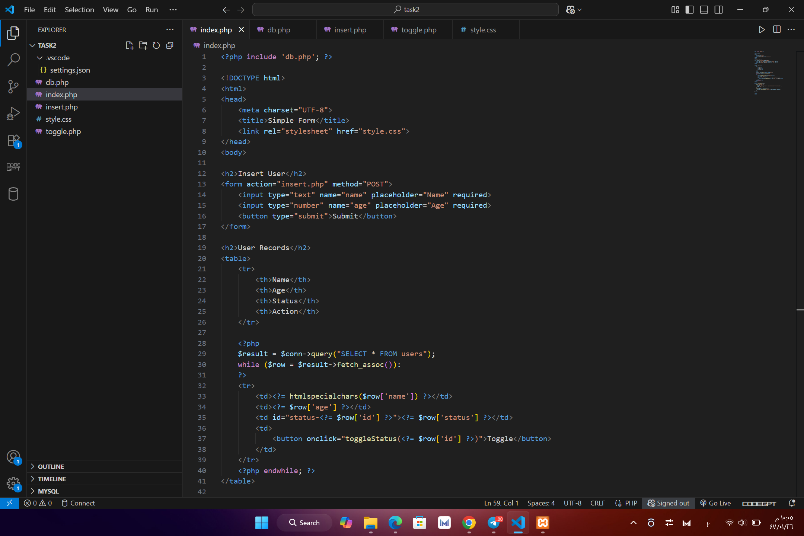

# Simple Task System Project

A simple PHP and MySQL web application for managing user records and task status updates locally using XAMPP.

---

## Project Preview

<p align="center">
  
</p>

<p align="center">
  
</p>

---

## Overview

This project is a simple web application built with PHP and MySQL for managing a basic task list system.

Users can submit their name and age through a form, and the data is stored in a MySQL database.  
All records are displayed dynamically in a table with a toggle button that updates the status instantly using JavaScript Fetch API without reloading the page.

---

## Features

- Add new user records
- Store data using MySQL
- Display all records dynamically
- Toggle status between `0` and `1`
- Instant status update using Fetch API
- Simple responsive UI
- Local server support using XAMPP

---

## Technologies Used

- PHP
- MySQL
- HTML
- CSS
- JavaScript
- Fetch API
- XAMPP

---

## Project Structure

```text
project/
├── index.php
├── db.php
├── insert.php
├── toggle.php
├── style.css
└── screenshots/
```

---

## Setup and Run Locally

### Requirements

- XAMPP or any local PHP server
- MySQL
- Modern web browser

---

### Installation Steps

1. Start Apache and MySQL from XAMPP.

2. Open phpMyAdmin:

```text
http://localhost/phpmyadmin
```

3. Create a database named:

```text
task2
```

4. Run the following SQL query:

```sql
CREATE TABLE users (
    id INT AUTO_INCREMENT PRIMARY KEY,
    name VARCHAR(100),
    age INT,
    status TINYINT(1) DEFAULT 0
);
```

5. Move the project folder into:

```text
C:\xampp\htdocs\
```

6. Open the project in your browser:

```text
http://localhost/smart_task2/
```

---

## Important Note

This project was developed for training and learning purposes in a local environment using XAMPP.

Before running the project locally, make sure your database connection settings inside `db.php` match your local MySQL configuration.

---

## Future Improvements

- User authentication system
- Record editing and deletion
- Input validation
- Better UI/UX
- Secure database handling
- Deployment support

---

## Author

Waleed Alharbi
